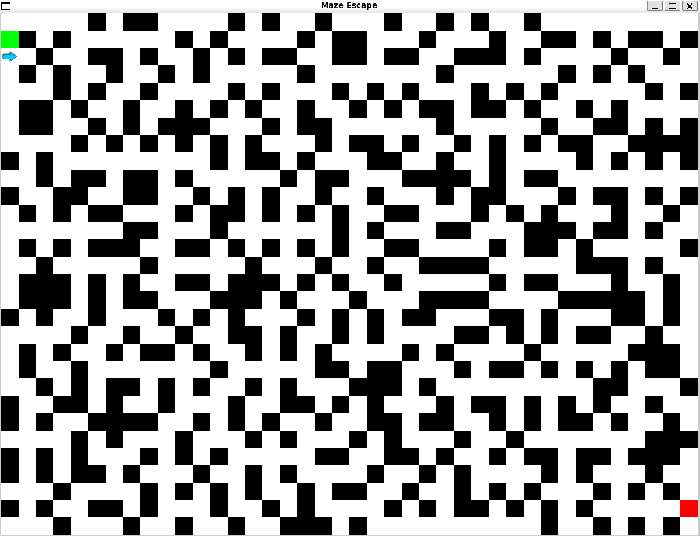

# Maze Escape with Double Q-Learning

A reproducible reinforcement-learning demo in which an agent collects every flag and exits a randomly generated maze. The default agent uses Double Q-learning; a standard tabular Q-learning baseline and an optional DQN implementation are included.



## Setup

Requires Python 3.10 or newer.

```bash
python -m venv .venv
source .venv/bin/activate  # Windows: .venv\Scripts\activate
pip install -r requirements.txt
python main.py --episodes 100 --seed 42
```

Add `--render` to visualize the learned policy and `--plot` to display episode lengths. Select a generator with `--algorithm prim`, `eller`, or `hunt-and-kill`; view all options with `python main.py --help`.

## Formulation

The state contains the agent position and collected-flag set. The four actions move up, down, left, or right. Rewards encourage flag collection and successful exit while penalizing steps, revisits, and invalid moves. Episodes terminate after escape or the configured `--max-steps` limit.

Double Q-learning maintains two value tables. Each update selects the maximizing action with one table and evaluates it with the other, reducing maximization bias.

## Tests

```bash
python -m unittest discover -s tests
```

For the optional DQN experiment, install `requirements-dqn.txt` and run `python train_dqn.py`.

## License

MIT
